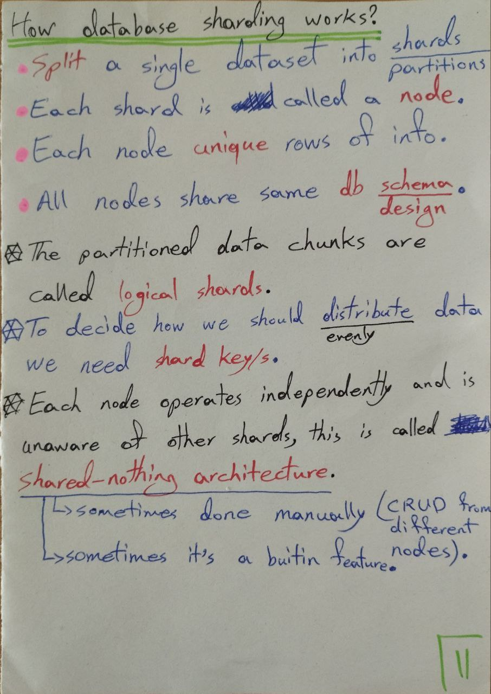
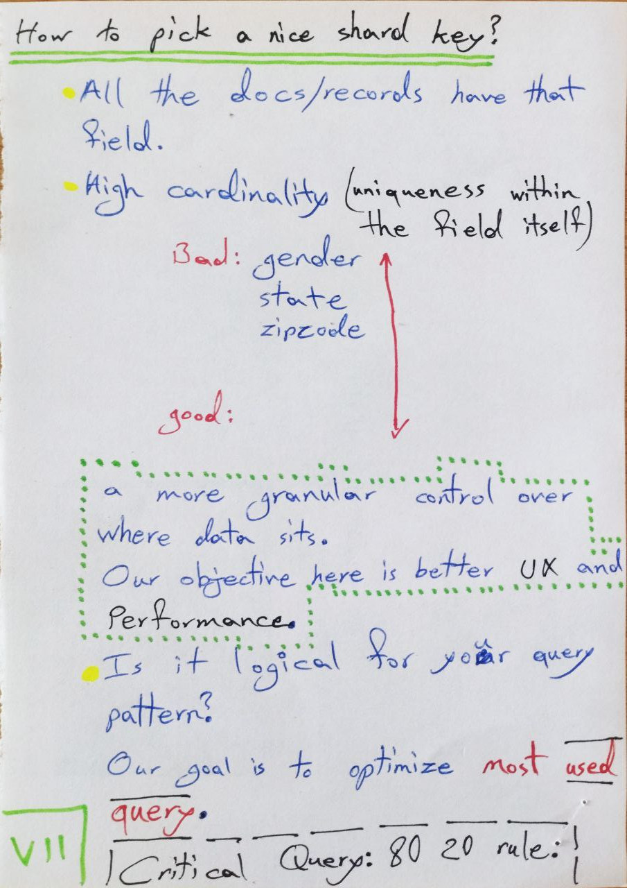
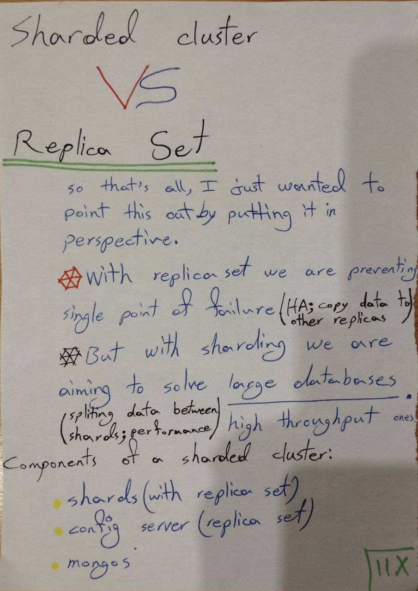
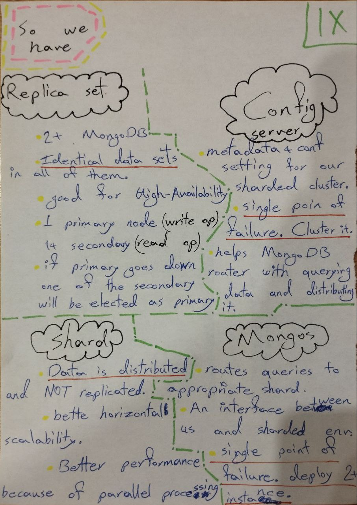
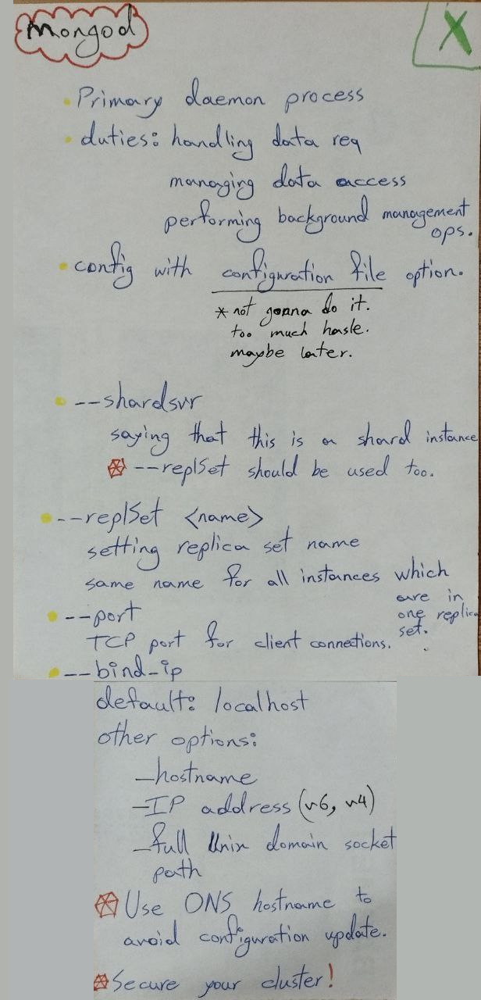
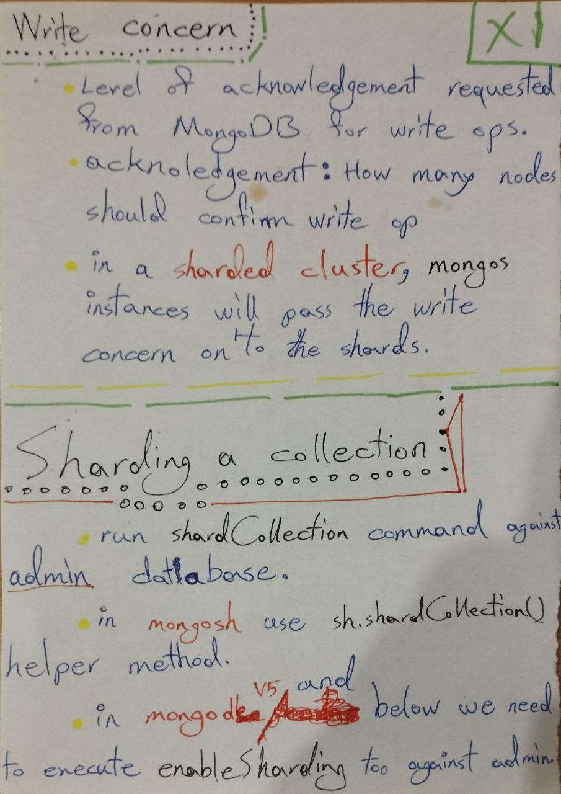
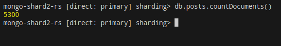
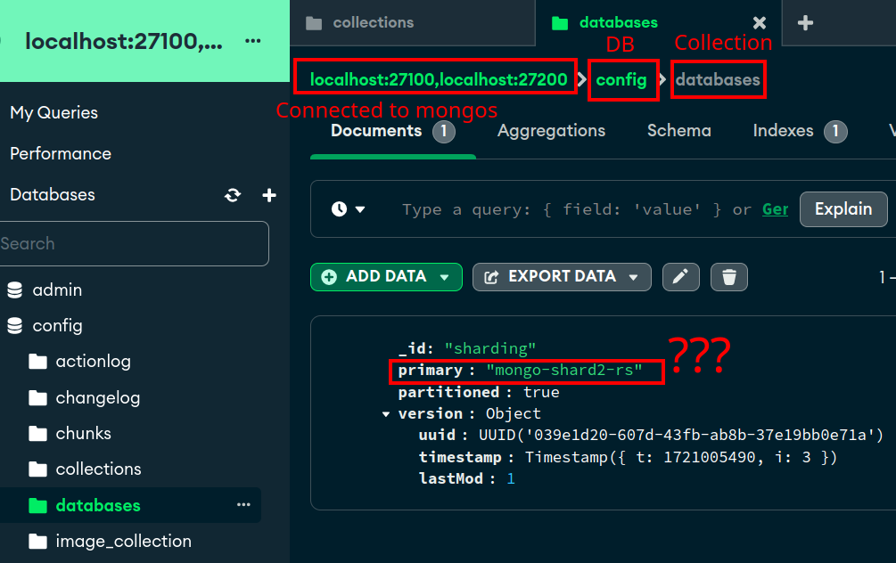

# Intro

So you wanna learn what is sharding. Congrats, you've ended up in the right place. Learn more about sharing in **general** [here](https://aws.amazon.com/what-is/database-sharding/). And also see the examples implemented here in this repo by watching this [YouTube video](https://youtu.be/8sk75-6W0ik?si=qICl1DboCdU4V3mB).

## My handwritings for it

If you are able to make sense of what I wrote here you go:











But if you cannot, do not worry too much. I guess you could just go to the first two links I shared in order to gain a better understanding of what is going on here :slightly_smiling_face:.

## Bumps:

### First bump




For some reason it is not distributing documents, either misconfigured shard key or sharded database since I also dunno why it is saying this, why second shard is primary. I know that I did not specify who should be primary but I am sure I added first shard first. I'll investigate it:



## What are we using here?

- [`nx`](https://nx.dev/)
- [`NodeJS`](https://nodejs.org/en)
- [_NestJS_](https://nestjs.com/)
- [`NodeJS native test runner`](https://dev.to/mbarzeev/is-nodejs-test-runner-dev-ready-4gm8)
- [`Automated tests`](https://docs.github.com/en/actions/automating-builds-and-tests/building-and-testing-nodejs)

### Why NestJS?

- Highly opinionated and structured, promoting best practices.
- Built-in support for TypeScript, making it easier to write maintainable and scalable code.
- Includes many built-in features like dependency injection, modular architecture, and an easy-to-use CLI.
- Great for large-scale applications due to its modular structure.

#### How to add new apps?

```cmd
nx g @nx/nest:app app-name --directory apps/app-name
```

#### How to start it?

```cmd
cp .env.example .env
bash sharded-cluster.sh
nx serve mongodb-sharding
```

### Why Mongoose?

- Mongoose's `HydratedDocument` type transforms a raw document interface into the type of the hydrated Mongoose document, including virtuals, methods, etc.
