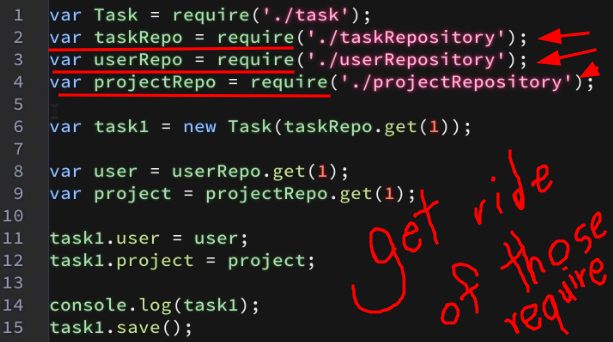

# design-patterns-in-js

Design-patterns in JavaScript/Typescript, NodeJS

## Design-Patterns

### Creational Design-patterns

-   Create new Objects based on the situation
-   Binding `this` to the created Object

#### Module pattern

-   Encapsulation in JavaScript
-   Something like a toolbox
-   Real examples - Services: Database module, Email module]
-   Just methods not properties

#### Factory pattern

-   Create object simpler
-   Create objects based on demand
-   Get ride of too many imports/require

</img>

---

---

### Structural patterns

-   This patterns concerns about the objects relationships
-   Extending and Simplifying functionalities
-   types: Decorator patterns,

#### Decorator Pattern

-   Extended inheritance
    -   Add new functionalities
-   Protect object from changes
-   This decorator has nothing to do with Typescript decorators

#### Facade Pattern

-   Hide complexities
-   Simple API
    -   Not new feature
-   jQuery is the best example

---

---

#### Flyweight Pattern

-   Share common data between objects
-   If you have too many large objects implement this pattern
